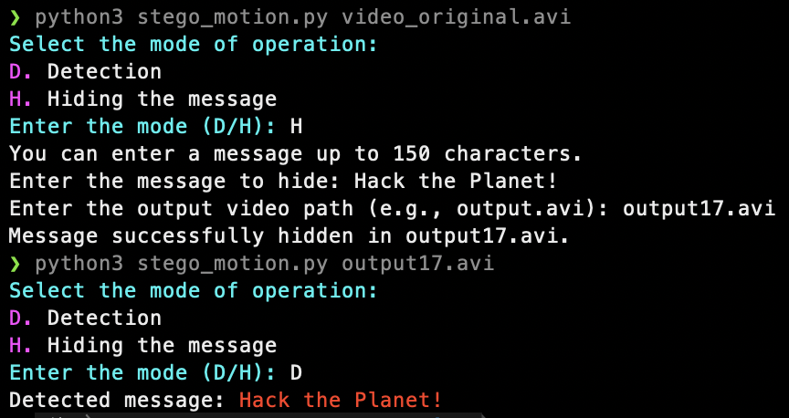

# stego_motion

This Python program is a script for performing steganography on video files, specifically AVI and MOV formats. Steganography is the practice of hiding information within a medium, such as an image or video, in a way that is not immediately apparent to an observer.

Here's a breakdown of what this script does:

- It starts by importing the necessary libraries, including `cv2` for video processing and `numpy` for numerical operations.
- It defines a constant `BIT_DEPTH` with a value of `8`, which represents the number of bits used to encode each character.
- The script defines a class called `StegoMotion`, which is used for performing steganography on video files.
- The constructor `__init__` initializes the class with the path to a video file. It extracts information about the video, such as the number of frames, frame width, frame height, and frames per second (fps).
- The class provides methods for embedding and extracting hidden information in video frames:
  - `embed_character`: Embeds a character (typically a message) into a video frame by modifying the least significant bits of the pixel values.
  - `embed_message`: Embeds a message into the video frames and saves the output video.
  - `extract_bits`: Extracts the least significant bit of each pixel in a frame.
  - `extract_length`: Extracts the length of the hidden message from the video.
  - `extract_character`: Extracts a character from a video frame.
  - `extract_message`: Extracts the hidden message from the video.
  - `get_max_chars`: Returns the maximum number of characters that can be embedded in the video.
- In the main function, the script takes command-line arguments to specify the video file to work with and the operation mode (either "D" for detection or "H" for hiding a message).
- Depending on the mode selected, it either hides a message in the video or extracts a hidden message from the video.
  - In "H" mode (Hiding), it takes a message input from the user, checks if it can fit within the video, and then embeds the message in the video frames. The resulting video is saved as specified.
  - In "D" mode (Detection), it extracts the hidden message from the video and displays it.

The script uses ANSI escape codes for text colors to provide a more user-friendly command-line interface.

You can use this script to hide and extract messages in video files, allowing you to perform steganography on videos.

## Installation

1. Make sure you have Python 3 installed on your system.
2. Install the required packages using the following command:
   ```
   pip install opencv-python numpy
   ```

## Usage

1. Run the `stego_motion.py` script using the command:
   ```
   python stego_motion.py <target AVI or MOV file>
   ```
2. Select the desired mode of operation (hide or detect) and follow the dialogue as seen below:


## Lossless Video Steganography

This steganography script utilizes a **lossless** video codec, which means that it preserves all the details and quality of the original video. While this results in superior video quality, it also leads to **larger file sizes** compared to lossy compression methods.

### Why is the video file size large?

- **Lossless Compression:** Lossless compression ensures that no information is discarded during the encoding process. Every pixel and frame is preserved with utmost fidelity, maintaining the video's original quality.
- **Uncompressed Frames:** The script embeds hidden data within individual frames of the video. To maintain lossless quality, each frame remains uncompressed, contributing to the overall file size.

### Considerations:

- **Storage Space:** Be aware that the resulting video files can be **considerably large**. Ensure you have sufficient storage capacity when working with these lossless steganography videos.
- **Transmission:** When sharing or transmitting these videos, consider the time and bandwidth required, especially if you are dealing with lengthy videos.

### Benefits:

- **High Quality:** Lossless videos are suitable for applications where maintaining the highest possible video quality is essential, such as forensic analysis, archiving, or situations where every pixel matters.
- **Message Preservation:** The lossless nature of the video ensures that any hidden messages are preserved with complete fidelity, minimizing the risk of data loss.

Remember that the choice between lossless and lossy compression depends on your specific use case and priorities. Lossless compression prioritizes quality, while lossy compression sacrifices some quality to achieve smaller file sizes.
